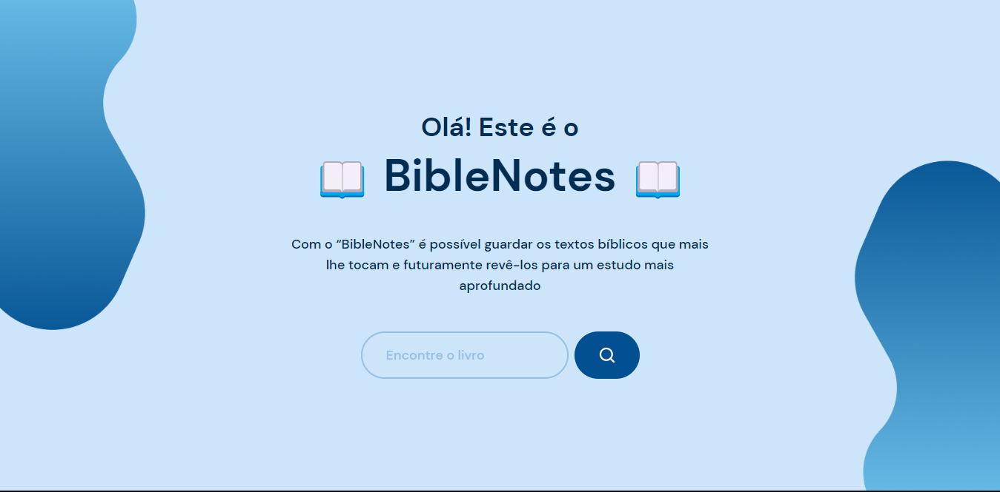

# BibleNotes

O "BibleNotes" é um projeto desenvolvido para ser similar a um bloco de notas. Nele serão inseridas pesquisas sobre a bíblia, possibilitando a adição de textos bíblicos relacionados e que futuramente poderiam ser encontrados na barra de pesquisa.  

### 
🚧🚧🚧🚧🚧 Em desenvolvimento 🚧🚧🚧🚧🚧

### 👨‍💻 **Tecnologias**

- Vite (React.js)
- Tailwind (CSS)
- JavaScript

### 😀 **Autor**

Feito por Jonathan Amarante 👋🏽 Entre em contato!

